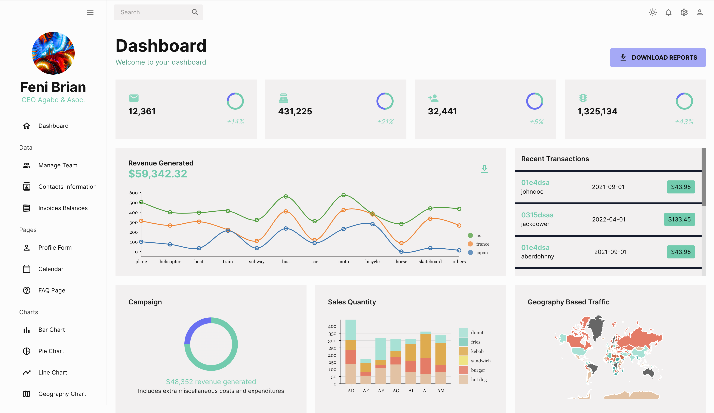

# ADMIN
------------

------------

## Introduction
This is a full-stack MERN build using the latest web development technologies around. It's built on the [React](https://react.dev) framework and hosted via [Vercel](https://vercel.com/).

## Packages

### Development
During development, install the following packages using the package manager of your choice.
> Try not to use different package managers for the client and server sides of the app. Stick to one, at most.
```bash
@emotion/react
@emotion/styled
@fullcalendar/core
@fullcalendar/daygrid
@fullcalendar/interaction
@fullcalendar/list
@fullcalendar/react
@fullcalendar/timegrid
@mui/icons-material
@mui/material
@mui/x-data-grid
@nivo/bar
@nivo/core
@nivo/geo
@nivo/line
@nivo/pie
@reduxjs/toolkit
@testing-library/jest-dom
@testing-library/react
@testing-library/user-event
chart.js
formik
react-chartjs-2
react-pro-sidebar
react-redux
react-router-dom
react-scripts
web-vitals
yup
```


## Credits

All Credit 👏🏾 goes to ***EdRoh*** for building the original app on which I based mine off of; it's exactly the same with some minor changes. 
To see the code base for the original app, here's the link to the github [repo](https://github.com/ed-roh/react-admin-dashboard.git). Make sure to leave a star.
In addition, watch the youtube [tutorial](https://youtu.be/wYpCWwD1oz0) and don't forget to like it if you do.

### Images
Profile image: ***Photo by [Milad Fakurian](https://unsplash.com/@fakurian?utm_source=unsplash&utm_medium=referral&utm_content=creditCopyText) on [Unsplash](https://unsplash.com/photos/58Z17lnVS4U?utm_source=unsplash&utm_medium=referral&utm_content=creditCopyText)***
  